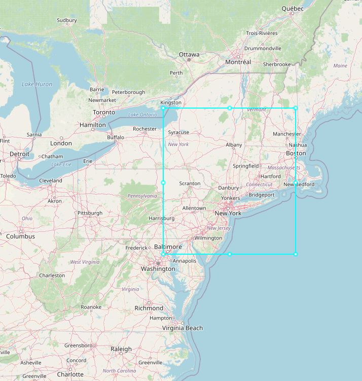
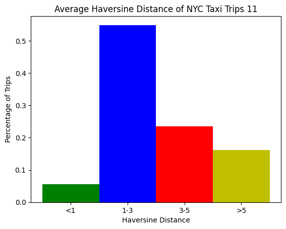
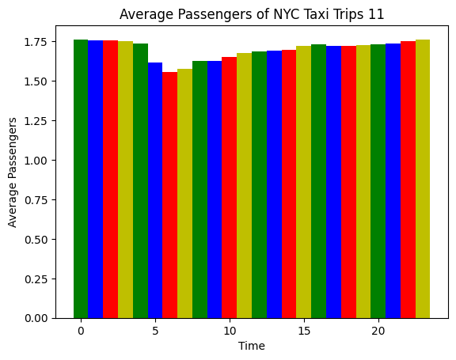
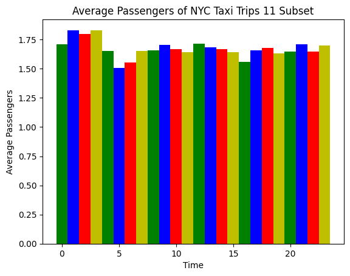

# My Taxi Project

## 1 
The NYC taxi file (trip_data_11.csv) ranges between 2013-11-01 at 00:00:07 and 2013-12-01 at 01:47:54. 

There are a total of 14388452 rows.

## 2 
The field names are: 
|Name | Description|
|---- | ----| 
 medallion | A string containing letters and numbers
 hack_license | A string containing letters and numbers
 vendor_id | A 3 letter string
 rate_code | An integer to desccribe the price rate of the trip
 store_and_fwd_flag | Either empty string or 'N'
 pickup_datetime | A date and time of pickup
 dropoff_datetime | A date and time of drop off
 passenger_count | An integer of number of passengers
 trip_time_in_secs | An integer of elapsed seconds of the trip
 trip_distance | A float of distance traveled in miles
 pickup_longitude | A float for pick up longitude
 pickup_latitude | A float for pick up latitude
 dropoff_longitude | A float for drop off longitude
 dropoff_latitude | A float for drop off latitude

## 3
The field names and a row of data is:  

medallion | hack_license | vendor_id | rate_code | store_and_fwd_flag |
|----|----|----|----|----|
03433D4310F10E0DFA32737C788035B1 | D244B4FDD5DEE7DB7A1B96C577F64168 | VTS | 1 | N/A

Table Continued:  
 |pickup_datetime | dropoff_datetime | passenger_count | trip_time_in_secs | trip_distance   pickup_longitude | pickup_latitude | dropoff_longitude | dropoff_latitude
|----|----|----|----|----|----|----|----|
 2013-11-06 21:20:00 | 2013-11-06 21:50:00 | 2 | 1800 | 10.74 | -73.874573 | 40.774063 | -73.980797 | 40.763554

## 4
Potential SQL Datatypes: 
|Name | Datatype|
|---- | ----| 
 medallion | varchar(32)
 hack_license | varchar(32)
 vendor_id | varchar(3)
 rate_code | int(3)
 store_and_fwd_flag | varchar(1) or bool
 pickup_datetime | datetime
 dropoff_datetime | datetime
 passenger_count | int(2)
 trip_time_in_secs | int(6)
 trip_distance | decimal(6,2)
 pickup_longitude | decimal(8,6)
 pickup_latitude | decimal(8,6)
 dropoff_longitude | decimal(8,6)
 dropoff_latitude | decimal(8,6)

## 5
The boundedgeographic range of this data is: 
coords | [latitude, longitude]
|----|----|
min latitude | [39.195042, -76.8097]
min longitude | [39.195042, -76.8097]
max latitude | [43.933346, -75.395187]
max longitude | [42.347462, -71.084297]

The area covered by this dataset is graphed below.

I bounded the latitude and longitude coordinates as there were many outliers in the dataset. Within these bounds lies 98% of all taxi trips in the dataset. 

## 6
The average haversine distance covered from the taxi trips is graphed below.

## 7
Distinct values for some data fields include:
 
 Medallion and hack_license are both 32 characters strings that can have an incomprehensible amount of different values.

 vendor_id is either VTS or CMT. These are two taxi servide providers Verifone Transportation Systems (VTS) and Creative Mobile Technologies (CMT)

 rate_code is a code that determines the price of the fare of the taxi trip. From the dataset it can be any of the following numbers: 0, 1, 2, 3, 4, 5, 6, 7, 8, 9, 10, 210

 store_and_fwd_flag is either '' or 'N'.

## 8
Other numeric data min and max values: 
Name | Value
|----|----|
passengers |  1-208
seconds traveled |  1-10800
miles |  0.01-100.0
rate code | 0-210

## 9
A histogram of the average number of passengers per each hour of the day is seen below.

## 11
A histogram of the average number of passengers per each hour of the day based on a subset of the trip_data_11.csv dataset is seen below.

The two graphs have a very similar distribution of passengers per hour.